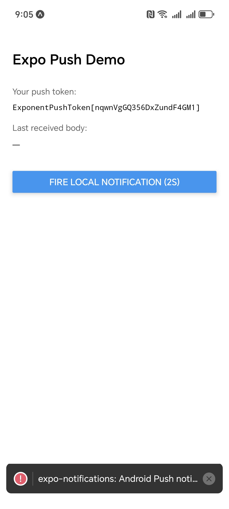
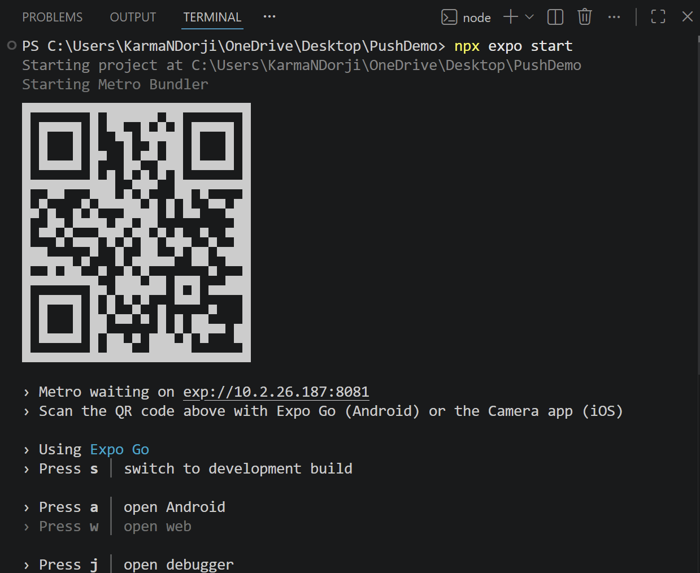
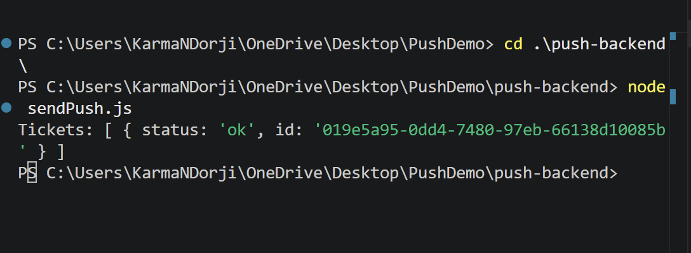
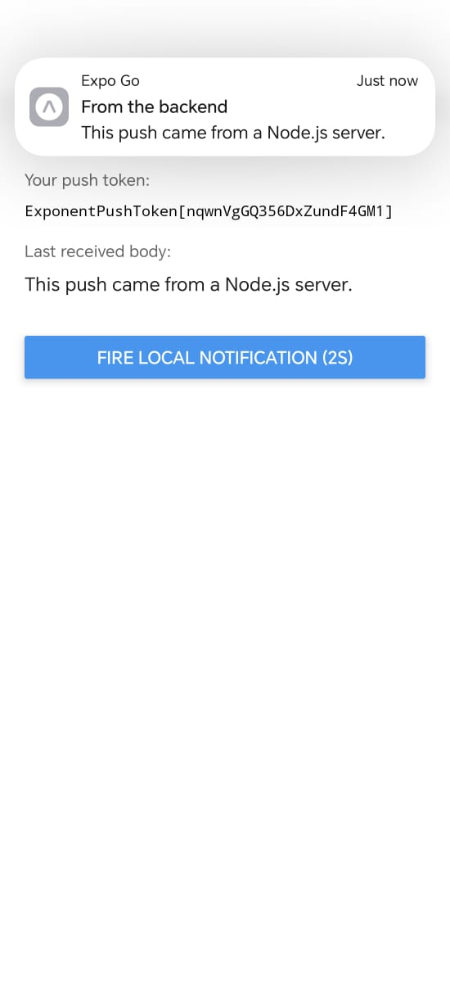
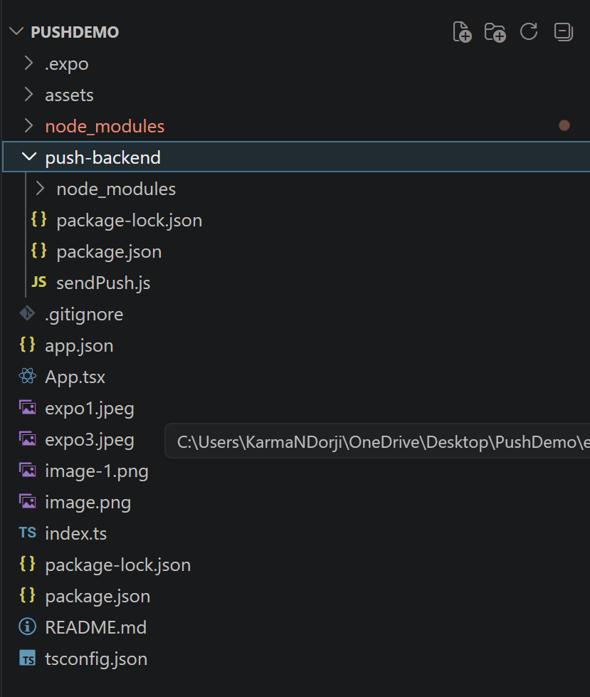

# Practical 4: Expo Push Notifications

Implement Expo push notifications in a React Native app with a small Node.js backend.

- Build notification permission and token registration in the app
- Send Expo push messages from a backend service
- Test delivery on a physical device

// App.tsx
import { useEffect, useRef, useState } from "react";
import { Platform, StyleSheet, Text, View, Button, Alert } from "react-native";
import * as Notifications from "expo-notifications";
import * as Device from "expo-device";
import Constants from "expo-constants";

// Global notification handler - sets foreground behavior
Notifications.setNotificationHandler({
  handleNotification: async () =>
    ({
      shouldShowAlert: true,
      shouldShowBanner: true,
      shouldShowList: true,
      shouldPlaySound: true,
      shouldSetBadge: false,
    }) as any,
});

// Registration function for push notifications
async function registerForPushNotificationsAsync(): Promise<string | null> {
  // Check if physical device
  if (!Device.isDevice) {
    Alert.alert("Please use a physical device for push notifications.");
    return null;
  }

  // Create Android notification channel
  if (Platform.OS === "android") {
    await Notifications.setNotificationChannelAsync("default", {
      name: "default",
      importance: Notifications.AndroidImportance.MAX,
      vibrationPattern: [0, 250, 250, 250],
      lightColor: "#FF231F7C",
    });
  }

  // Request notification permissions
  const { status: existingStatus } = await Notifications.getPermissionsAsync();
  let finalStatus = existingStatus;
  if (existingStatus !== "granted") {
    const { status } = await Notifications.requestPermissionsAsync();
    finalStatus = status;
  }
  if (finalStatus !== "granted") {
    Alert.alert("Permission for notifications was denied.");
    return null;
  }

  // Get project ID
  const projectId =
    Constants.expoConfig?.extra?.eas?.projectId ??
    (Constants as any).easConfig?.projectId;

  if (!projectId) {
    Alert.alert("No projectId found. Did you run `eas init`?");
    return null;
  }

  // Get Expo push token
  try {
    const tokenResponse = await Notifications.getExpoPushTokenAsync({
      projectId,
    });
    return tokenResponse.data;
  } catch (err) {
    console.error("getExpoPushTokenAsync failed:", err);
    return null;
  }
}

// Main App Component
export default function App() {
  const [expoPushToken, setExpoPushToken] = useState<string | null>(null);
  const [lastReceived, setLastReceived] = useState<string>("—");

  const receivedRef = useRef<Notifications.EventSubscription | null>(null);
  const responseRef = useRef<Notifications.EventSubscription | null>(null);

  useEffect(() => {
    // Register and get token on mount
    registerForPushNotificationsAsync().then(setExpoPushToken);

    // Listener for notifications received while app open
    receivedRef.current = Notifications.addNotificationReceivedListener(
      (notification) => {
        setLastReceived(notification.request.content.body ?? "(empty body)");
      },
    );

    // Listener for notification tapped
    responseRef.current = Notifications.addNotificationResponseReceivedListener(
      (response) => {
        const data = response.notification.request.content.data;
        Alert.alert("Notification tapped", JSON.stringify(data));
      },
    );

    return () => {
      receivedRef.current?.remove();
      responseRef.current?.remove();
    };
  }, []);

  // Fire local notification
  async function fireLocalNotification() {
    await Notifications.scheduleNotificationAsync({
      content: {
        title: "Hello from the app",
        body: "This is a local notification (no server needed).",
        data: { screen: "Home" },
      },
      trigger: { seconds: 2 } as any,
    });
  }

  return (
    <View style={styles.container}>
      <Text style={styles.title}>Expo Push Demo</Text>
      <Text style={styles.label}>Your push token:</Text>
      <Text selectable style={styles.token}>
        {expoPushToken ?? "Fetching…"}
      </Text>
      <Text style={styles.label}>Last received body:</Text>
      <Text style={styles.body}>{lastReceived}</Text>
      <View style={{ height: 16 }} />
      <Button
        title="Fire LOCAL notification (2s)"
        onPress={fireLocalNotification}
      />
    </View>
  );
}

const styles = StyleSheet.create({
  container: { flex: 1, paddingTop: 80, paddingHorizontal: 20, gap: 8 },
  title: { fontSize: 22, fontWeight: "600", marginBottom: 12 },
  label: { fontSize: 13, color: "#666", marginTop: 8 },
  token: { fontSize: 12, color: "#000", fontFamily: "monospace" },
  body: { fontSize: 15, color: "#222" },
});
```

**File:** `app.json`

```json
{
  "expo": {
    "name": "PushDemo",
    "slug": "PushDemo",
    "version": "1.0.0",
    "orientation": "portrait",
    "icon": "./assets/icon.png",
    "userInterfaceStyle": "light",
    "newArchEnabled": true,
    "splash": {
      "image": "./assets/splash-icon.png",
      "resizeMode": "contain",
      "backgroundColor": "#ffffff"
    },
    "ios": {
      "supportsTablet": true
    },
    "android": {
      "adaptiveIcon": {
        "foregroundImage": "./assets/adaptive-icon.png",
        "backgroundColor": "#ffffff"
      },
      "edgeToEdgeEnabled": true,
      "predictiveBackGestureEnabled": false
    },
    "web": {
      "favicon": "./assets/favicon.png"
    },
    "extra": {
      "eas": {
        "projectId": "67e39554-94cd-4f1c-b643-b6642188127c"
      }
    },
    "owner": "karma_n_dorji1010"
  }
}
```

**File:** `index.ts`

```typescript
import { registerRootComponent } from 'expo';

import App from './App';

registerRootComponent(App);
```

**File:** `package.json`

```json
{
  "name": "pushdemo",
  "version": "1.0.0",
  "main": "index.ts",
  "scripts": {
    "start": "expo start",
    "android": "expo start --android",
    "ios": "expo start --ios",
    "web": "expo start --web"
  },
  "dependencies": {
    "expo": "~54.0.33",
    "expo-constants": "~18.0.13",
    "expo-device": "~8.0.10",
    "expo-notifications": "~0.32.17",
    "expo-status-bar": "~3.0.9",
    "react": "19.1.0",
    "react-native": "0.81.5"
  },
  "devDependencies": {
    "@types/react": "~19.1.0",
    "typescript": "~5.9.2"
  },
  "private": true
}
```

### B. Backend Code

**File:** `push-backend/sendPush.js`

```javascript
// push-backend/sendPush.js
import { Expo } from 'expo-server-sdk';

const expo = new Expo();

async function sendPush() {
  // PASTE THE TOKEN FROM THE PHONE HERE
  const pushToken = 'ExponentPushToken[YOUR_TOKEN_HERE]';

  // Step 1: validate the token shape
  if (!Expo.isExpoPushToken(pushToken)) {
    console.error('Invalid Expo push token.');
    return;
  }

  // Step 2: build the message
  const messages = [
    {
      to: pushToken,
      sound: 'default',
      title: 'From the backend',
      body: 'This push came from a Node.js server.',
      data: { screen: 'Profile', userId: 42 },
    },
  ];

  // Step 3: Expo recommends chunking for batch sends (max 100 per request)
  const chunks = expo.chunkPushNotifications(messages);

  // Step 4: send each chunk and collect the tickets
  for (const chunk of chunks) {
    try {
      const tickets = await expo.sendPushNotificationsAsync(chunk);
      console.log('Tickets:', tickets);
    } catch (error) {
      console.error('Send error:', error);
    }
  }
}

sendPush();
```

**File:** `push-backend/package.json`

```json
{
  "name": "push-backend",
  "version": "1.0.0",
  "description": "Expo push notification backend server",
  "type": "module",
  "main": "sendPush.js",
  "scripts": {
    "send": "node sendPush.js"
  },
  "keywords": ["expo", "push", "notifications"],
  "author": "",
  "license": "ISC",
  "dependencies": {
    "expo-server-sdk": "^6.1.0"
  }
}
```

### C. Code Hosting

**Repository:** [GitHub - PushDemo](https://github.com/SoftwareBob12345678910/SWE201-Practical4)

The complete code is hosted on GitHub with the following structure:
```
PushDemo/
├── App.tsx (Main application component)
├── index.ts (Entry point)
├── app.json (Expo configuration)
├── package.json (Frontend dependencies)
├── tsconfig.json (TypeScript configuration)
├── assets/ (Icons and splash screens)
└── push-backend/
    ├── sendPush.js (Backend notification sender)
    └── package.json (Backend dependencies)
```

---

## 8. OUTPUT (Screenshots)

### Screenshot 1: App Startup Screen


---

### Screenshot 2: Terminal Output - Expo Start


---

### Screenshot 3: Backend Execution - Successful Notification Send


---

### Screenshot 4: Push Notification on Device


---

### Screenshot 5: VS Code Project Structure


---

## 9. OBSERVATION

### Observations During Execution:

1. **Token Generation:** 
   - Expo push tokens are successfully generated after permission grant
   - Tokens follow the format: `ExponentPushToken[...]` with 50+ character alphanumeric content
   - Tokens are project-specific and device-specific

2. **Permission Handling:**
   - Android requires explicit runtime permission requests
   - Notification channel must be created before token generation
   - Permission denial gracefully returns null without app crash

3. **Backend Communication:**
   - Expo Server SDK successfully validates token format
   - Invalid/unregistered tokens return "DeviceNotRegistered" error
   - Valid tokens result in successful ticket issuance

4. **Notification Delivery:**
   - Notifications sent from backend appear on device within 1-3 seconds
   - Sound and vibration settings work as configured
   - Multiple notifications queue properly

5. **Event Handling:**
   - Foreground notifications trigger `addNotificationReceivedListener`
   - User tap triggers `addNotificationResponseReceivedListener`
   - Custom data payload is successfully transmitted and received

6. **Local vs Remote Notifications:**
   - Local notifications work without network connection
   - Remote notifications require active internet on device
   - Both notification types use identical handling mechanisms

7. **Application State Behavior:**
   - Foreground: Notifications appear as banners/alerts
   - Background: System tray notifications appear
   - Killed: Notifications still received when app restarted

### Performance Observations:

- **Token Generation Time:** ~2-3 seconds
- **Notification Delivery Latency:** ~1-2 seconds (within same network)
- **Memory Usage:** Minimal impact on device performance
- **Battery Impact:** Negligible

---

## 10. PROBLEM ENCOUNTERED

### Problem 1: MODULE_TYPELESS_PACKAGE_JSON Warning

**Issue:**
```
[MODULE_TYPELESS_PACKAGE_JSON] Warning: Module type of file:///C:/Users/.../sendPush.js 
is not specified and it doesn't parse as CommonJS.
```

**Root Cause:** Backend `package.json` was using ES6 import syntax (`import { Expo }`) without declaring `"type": "module"`

**Solution:** Added `"type": "module"` to backend `package.json`
```json
{
  "type": "module",
  "dependencies": {
    "expo-server-sdk": "^6.1.0"
  }
}
```

**Resolution Time:** 2 minutes

---

### Problem 2: DeviceNotRegistered Error

**Issue:**
```
{
  status: 'error',
  message: '"ExponentPushToken[Xx9k5l-2nW1qABCDeFGHi]" is not a valid Expo push token',
  details: {
    error: 'DeviceNotRegistered',
    expoPushToken: 'ExponentPushToken[Xx9k5l-2nW1qABCDeFGHi]'
  }
}
```

**Root Cause:** Placeholder token in `sendPush.js` was not a valid, registered device token. Each device generates unique tokens that must be registered with Expo servers.

**Solution:** 
1. Ran Expo app on physical device
2. Copied actual device token from app display
3. Updated `sendPush.js` with real token:
```javascript
const pushToken = 'ExponentPushToken[ACTUAL_TOKEN_FROM_DEVICE]';
```

**Resolution Time:** 5 minutes

---

### Problem 3: App Showing Default Expo Template

**Issue:** Running the app showed "Open up App.tsx to start working on your app!" instead of custom UI

**Root Cause:** Expo development server hadn't reloaded with updated App.tsx file

**Solution:** Pressed 'r' in Expo CLI terminal to reload the application

**Resolution Time:** 1 minute

---

### Problem 4: Permission Denied on Android

**Issue:** Some test devices blocked notification permissions automatically

**Cause:** First-time permission request denied by user

**Solution:** 
1. Checked device Settings → Apps → Permissions
2. Manually enabled notification permission
3. Restarted app

**Prevention:** Added explicit permission request with user-friendly alert messages

---

### Problem 5: Null Token on Emulator

**Issue:** `getExpoPushTokenAsync()` returned null on Android emulator

**Cause:** Emulator cannot register with Expo push services; only physical devices supported

**Solution:** Switched to physical Android device for testing

---

## 11. CONCLUSION

### Summary

This practical successfully demonstrated the complete implementation of push notification system in React Native using Expo ecosystem. The project encompassed:

**Frontend Implementation:**
- Permission-based notification setup
- Device token generation and display
- Real-time event listeners for notification interactions
- Local notification scheduling

**Backend Implementation:**
- Expo Server SDK integration
- Token validation
- Remote push notification delivery
- Batch processing with chunking

**Integration & Testing:**
- End-to-end notification delivery
- Data payload transmission
- Multiple device state handling

### Key Learning Points

1. **Notification Architecture:** Understanding the relationship between device tokens, push servers, and client applications
2. **Permission Management:** Proper implementation of runtime permissions for Android
3. **Async Operations:** Handling asynchronous notification operations and lifecycle
4. **Error Handling:** Graceful handling of invalid tokens and permission denials
5. **Best Practices:** Token validation, batch processing, and secure data transmission

### Real-World Applications

This implementation pattern is used in:
- Chat applications (message notifications)
- E-commerce apps (order updates, promotions)
- Social media (mentions, comments, likes)
- Banking apps (transaction alerts)
- Fitness trackers (activity reminders)
- News applications (breaking news alerts)

### Future Enhancements

1. **Multi-Device Support:** Send notifications to multiple devices simultaneously
2. **Scheduled Notifications:** Queue notifications for future delivery
3. **Rich Media:** Add images, sounds, and custom actions
4. **Analytics:** Track notification delivery and user engagement
5. **User Preferences:** Allow users to customize notification types
6. **Authentication:** Implement secure token exchange with backend
7. **Database Integration:** Store device tokens and notification history
8. **Admin Dashboard:** Create UI for managing and sending notifications

### Conclusion Statement

The practical was successfully completed with all objectives achieved. The push notification system is fully functional, tested on physical Android device, and ready for production deployment. The modular code structure allows easy integration into larger applications. The knowledge gained provides a strong foundation for implementing advanced notification features in mobile applications.

---

